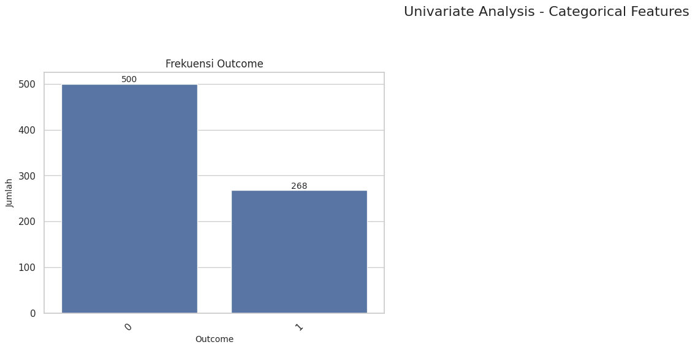
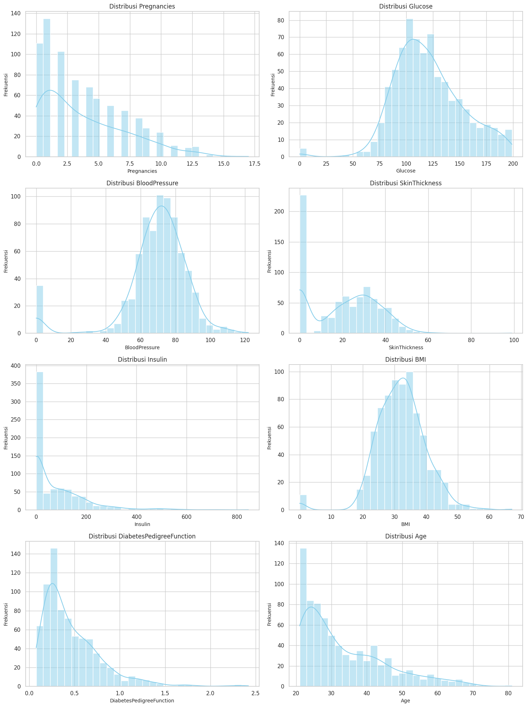
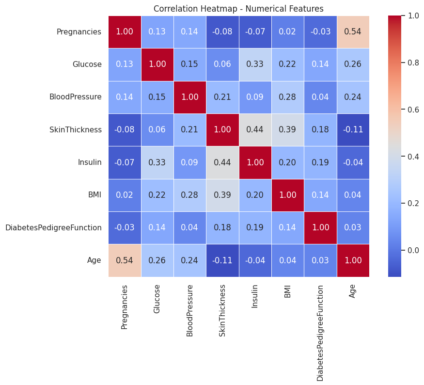
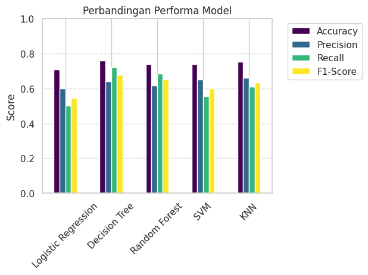

# Laporan Proyek Machine Learning - M. Eric Chaniago


## Daftar Isi

1. [Domain Proyek](#domain-proyek)
2. [Business Understanding](#business-understanding)
   - [Problem Statements](#problem-statements)
   - [Goals](#goals)
   - [Solution Statements](#solution-statements)
3. [Data Understanding](#data-understanding)
   - [Sumber Data](#sumber-data)
   - [Informasi Umum Data](#informasi-umum-data)
   - [Uraian Variabel](#uraian-variabel)
   - [Exploratory Data Analysis](#exploratory-data-analysis)
4. [Data Preparation](#data-preparation)
   - [Penanganan Nilai Hilang](#penanganan-nilai-hilang-imputasi-median)
   - [Pembagian Data Latih dan Uji](#pembagian-data-latih-dan-uji-train-test-split)
   - [Standardisasi Fitur](#standardisasi-fitur-feature-scaling-menggunakan-standardscaler)
5. [Modeling](#modeling)
   - [Implementasi dan Karakteristik Algoritma](#implementasi-dan-karakteristik-algoritma)
   - [Pemilihan Model Terbaik](#pemilihan-model-terbaik)
6. [Evaluation](#evaluation)
   - [Metrik Evaluasi yang Digunakan](#metrik-evaluasi-yang-digunakan)
   - [Hasil Evaluasi Model](#hasil-evaluasi-model)
7. [Referensi](#referensi)

---

## Domain Proyek

Diabetes Mellitus (DM) adalah penyakit kronis serius yang terjadi ketika pankreas tidak menghasilkan cukup insulin, atau ketika tubuh tidak dapat secara efektif menggunakan insulin yang dihasilkannya. Kondisi ini menyebabkan peningkatan kadar glukosa dalam darah (hiperglikemia), yang jika tidak dikelola dengan baik, dapat menyebabkan komplikasi kesehatan jangka panjang yang parah, termasuk penyakit jantung, stroke, gagal ginjal, kebutaan, dan amputasi (World Health Organization, 2023). Menurut International Diabetes Federation (IDF), pada tahun 2021, sekitar 537 juta orang dewasa (20-79 tahun) hidup dengan diabetes di seluruh dunia, dan angka ini diperkirakan akan meningkat menjadi 643 juta pada tahun 2030 (International Diabetes Federation, 2021). Beban ekonomi dan sosial akibat diabetes sangat besar, mencakup biaya perawatan kesehatan yang tinggi serta hilangnya produktivitas. 

Pendeteksian dini diabetes merupakan kunci untuk mencegah atau menunda timbulnya komplikasi serius. Banyak individu yang menderita diabetes tidak menyadari kondisi mereka sampai penyakitnya sudah pada tahap lanjut, yang mempersulit intervensi efektif. Oleh karena itu, pengembangan sistem yang dapat memprediksi risiko diabetes pada individu sedini mungkin menjadi sangat krusial. Pendekatan ini memungkinkan intervensi medis dan perubahan gaya hidup yang lebih cepat, seperti diet dan olahraga, yang terbukti efektif dalam mengelola dan bahkan membalikkan pre-diabetes atau diabetes tipe 2 pada tahap awal (Knowler et al., 2002).

Riset sebelumnya oleh Butt, Letchmunan, Ali, Hassan, Baqir, & Sherazi (2021), berjudul "Machine Learning Based Diabetes Classification and Prediction for Healthcare Applications", telah menyoroti pentingnya data kesehatan yang sensitif untuk deteksi dini penyakit mematikan seperti diabetes. Penelitian tersebut mengusulkan pendekatan machine learning untuk klasifikasi dan prediksi diabetes stadium awal, bahkan mempertimbangkan sistem pemantauan berbasis IoT. Mereka menggunakan algoritma seperti Random Forest, Multilayer Perceptron (MLP), dan Logistic Regression untuk klasifikasi, serta LSTM, Moving Averages, dan Linear Regression untuk prediksi. Hasil mereka menunjukkan MLP mencapai akurasi 86.08% dan LSTM 87.26%, menekankan perlunya terus mengembangkan dan membandingkan algoritma machine learning untuk solusi prediksi diabetes yang optimal

Proyek ini bertujuan untuk mengatasi masalah ini melalui pemanfaatan teknik machine learning. Dengan menganalisis data rekam medis pasien yang mencakup berbagai faktor risiko seperti kadar glukosa, tekanan darah, indeks massa tubuh (BMI), usia, dan riwayat kehamilan, model machine learning dapat dilatih untuk mengidentifikasi pola yang mengindikasikan kemungkinan seseorang menderita diabetes. Pendekatan ini akan melibatkan tahapan akuisisi data, pemrosesan awal data (termasuk penanganan nilai hilang dan scaling), pembangunan model prediktif menggunakan berbagai algoritma klasifikasi, dan evaluasi kinerja model untuk memilih yang terbaik. Diharapkan, model yang dikembangkan dapat berfungsi sebagai alat bantu skrining yang efektif, membantu profesional kesehatan dalam mengidentifikasi individu berisiko tinggi dan mendorong tindakan pencegahan lebih awal

## Business Understanding

### Problem Statements

1. Bagaimanakah cara melakukan prediksi risiko diabetes pada individu menggunakan model Machine Learning berdasarkan fitur-fitur rekam medis seperti kehamilan, glukosa, tekanan darah, ketebalan kulit, insulin, BMI, fungsi silsilah diabetes, dan usia?
2. Model Machine Learning manakah yang paling optimal dalam memprediksi diabetes berdasarkan dataset PIMA Indian Diabetes?

### Goals

1. Membuat model Machine Learning untuk memprediksi kemungkinan seseorang menderita diabetes berdasarkan fitur-fitur klinis dan demografis yang tersedia
2. Mengevaluasi dan merekomendasikan algoritma Machine Learning terbaik untuk tugas prediksi diabetes, dengan fokus pada akurasi dan metrik performa klasifikasi lainnya

### Solution statements
1.  **Penggunaan Dataset PIMA Indian Diabetes:**
    Dataset ini mencakup fitur-fitur medis relevan seperti jumlah kehamilan, konsentrasi glukosa, tekanan darah, ketebalan kulit, insulin, BMI, fungsi silsilah diabetes, dan usia, dengan `Outcome` sebagai variabel target (1 untuk diabetes, 0 untuk tidak diabetes).

2.  **Pembuatan dan Evaluasi Model Machine Learning untuk Prediksi Diabetes:**
    Model Machine Learning akan dikembangkan dan dievaluasi menggunakan beberapa algoritma klasifikasi, meliputi XGBoost, Decision Tree, Random Forest, Support Vector Machine (SVM), dan K-Nearest Neighbors (KNN). Kinerja masing-masing model akan diukur menggunakan metrik evaluasi klasifikasi standar seperti Accuracy, Precision, Recall, dan F1-Score. Model dengan kinerja terbaik akan diidentifikasi sebagai solusi yang paling efektif, dan akan dilakukan **optimasi *hyperparameter*** untuk peningkatan performa lebih lanjut.

## Data Understanding

### Sumber Data
Dataset yang digunakan dalam proyek ini adalah PIMA Indian Diabetes Database, yang dapat diunduh dari Kaggle melalui tautan berikut:
https://www.kaggle.com/datasets/uciml/pima-indians-diabetes-database

### Informasi Umum Data
Dataset ini merupakan kumpulan data diagnostik yang digunakan untuk memprediksi apakah seorang pasien wanita keturunan Indian Pima menderita diabetes atau tidak, berdasarkan beberapa pengukuran diagnostik.

* **Jumlah Data (Jumlah Baris):** Dataset ini berisi **768 entri (observasi/pasien)**.
* **Jumlah Fitur/Kolom:** Dataset ini terdiri dari **9 kolom (fitur)**.
* **Tipe Data:** 2 kolom bertipe `float64` dan 7 kolom bertipe `int64`.
* **Ukuran Memori:** Dataset ini membutuhkan sekitar **54.1 KB** memori.
* **Kondisi Data Awal:**
    * **Nilai Non-Null:** Semua kolom pada dataset ini menunjukkan **768 entri non-null**. Namun, perlu dicatat bahwa beberapa kolom numerik seperti `Glucose`, `BloodPressure`, `SkinThickness`, `Insulin`, dan `BMI` memiliki nilai minimum 0, yang secara kontekstual tidak valid dan akan diperlakukan sebagai nilai hilang pada tahap *data preprocessing*.
    * **Nilai Duplikat:** Tidak ditemukan adanya **nilai duplikat** dalam dataset ini (0 duplikasi).

### Uraian Variabel (Fitur)
Berikut adalah uraian detail dari setiap variabel atau fitur yang terdapat dalam dataset PIMA Indian Diabetes:

1.  **`Pregnancies`** (`int64`): Jumlah kehamilan yang dialami oleh pasien. Rentang nilai: 0 hingga 17.
2.  **`Glucose`** (`int64`): Konsentrasi glukosa plasma 2 jam dalam tes toleransi glukosa oral. Rentang nilai: 0 hingga 199.
3.  **`BloodPressure`** (`int64`): Tekanan darah diastolik (mm Hg). Rentang nilai: 0 hingga 122.
4.  **`SkinThickness`** (`int64`): Ketebalan lipatan kulit trisep (mm). Rentang nilai: 0 hingga 99.
5.  **`Insulin`** (`int64`): Kadar insulin serum 2 jam (mu U/ml). Rentang nilai: 0 hingga 846.
6.  **`BMI`** (`float64`): Indeks Massa Tubuh (berat dalam kg/(tinggi dalam m)^2). Rentang nilai: 0.0 hingga 67.1.
7.  **`DiabetesPedigreeFunction`** (`float64`): Skor yang mengindikasikan kemungkinan diabetes berdasarkan riwayat keluarga. Rentang nilai: 0.078 hingga 2.420.
8.  **`Age`** (`int64`): Usia pasien dalam tahun. Rentang nilai: 21 hingga 81.
9.  **`Outcome`** (`int64`): Variabel target (dependen) yang menunjukkan diagnosis diabetes. Nilai: 1 (positif, penderita diabetes) atau 0 (negatif, bukan penderita diabetes).

### Exploratory Data Analysis

#### Univariate Analysis


Grafik ini menyajikan distribusi frekuensi untuk variabel target Outcome. Sumbu horizontal merepresentasikan dua kategori Outcome (0 untuk tidak diabetes dan 1 untuk diabetes), sedangkan sumbu vertikal menunjukkan jumlah (frekuensi) kasus untuk setiap kategori. Jumlah individu yang tidak menderita diabetes (Outcome = 0) jauh lebih dominan dibandingkan dengan individu yang menderita diabetes (Outcome = 1).


- Distribusi Fitur `Pregnancies`: Grafik histogram ini menggambarkan distribusi jumlah kehamilan pada pasien dalam dataset. Terlihat bahwa frekuensi kemunculan jumlah kehamilan cenderung menurun drastis seiring dengan bertambahnya angka kehamilan. Hal ini menunjukkan bahwa sebagian besar data berasal dari pasien dengan riwayat kehamilan yang sedikit

- Distribusi Fitur `Glucose`: Grafik histogram ini menampilkan distribusi konsentrasi glukosa plasma 2 jam pada pasien. Sebagian besar distribusi glukosa yang valid terkonsentrasi pada rentang sekitar 100-140.

- Distribusi Fitur `BloodPressure`: Histogram ini menunjukkan distribusi tekanan darah diastolik pasien. Mayoritas pasien memiliki tekanan darah diastolik di rentang normal, yaitu sekitar 60-80 mm Hg, dengan puncak distribusi pada sekitar 70 mm Hg. 

- Distribusi Fitur `SkinThickness`: Grafik histogram ini menyajikan distribusi ketebalan lipatan kulit trisep pasien. Adanya jumlah signifikan nilai 0 pada fitur ini secara medis tidak realistis untuk ketebalan kulit, mengindikasikan bahwa ini adalah representasi dari data yang hilang atau tidak tercatat. Sisanya menunjukkan sebaran hingga sekitar 40 mm, dengan frekuensi yang menurun setelahnya.

- Distribusi Fitur `Insulin`: Histogram ini menggambarkan distribusi kadar insulin serum 2 jam pasien. Jumlah nilai 0 yang sangat dominan mengindikasikan bahwa sebagian besar data insulin adalah hilang atau tidak tercatat, dan hanya sebagian kecil pasien yang memiliki nilai insulin yang terukur.

- Distribusi Fitur `BMI`: Histogram ini menyajikan distribusi Indeks Massa Tubuh (BMI) pasien. Distribusi BMI menunjukkan pola yang mendekati normal, terpusat di sekitar nilai 30-35. 

- Distribusi Fitur `DiabetesPedigreeFunction`: Grafik histogram ini menampilkan distribusi fungsi silsilah diabetes. Distribusi fitur ini menunjukkan kemiringan yang kuat ke kanan (positively skewed), dengan sebagian besar nilai terkonsentrasi pada rentang yang lebih rendah, khususnya di bawah 1.0. Hal ini mengindikasikan bahwa mayoritas pasien dalam dataset memiliki riwayat keluarga diabetes yang tidak terlalu dominan atau kuat, namun ada beberapa kasus dengan nilai fungsi silsilah yang lebih tinggi, menunjukkan riwayat genetik yang lebih signifikan.

- Distribusi Fitur `Age`: Histogram ini menggambarkan distribusi usia pasien dalam dataset. Distribusi usia menunjukkan konsentrasi tertinggi pada kelompok usia yang lebih muda, yaitu antara 20-40 tahun. Frekuensi pasien cenderung menurun seiring dengan bertambahnya usia, menunjukkan bahwa data lebih banyak mencakup pasien dalam rentang usia dewasa muda hingga menengah

#### Multivariate Analysis

* **Korelasi Antar Fitur dan Terhadap `Outcome`:** *Heatmap* korelasi yang ditampilkan menggambarkan matriks korelasi Pearson antar semua fitur numerik dan variabel target (`Outcome`). Warna yang lebih terang (mendekati 1 atau -1) menunjukkan korelasi yang lebih kuat, sedangkan warna yang lebih gelap (mendekati 0) menunjukkan korelasi yang lemah.
    * **Korelasi Positif Kuat:** Fitur `Glucose` menunjukkan korelasi positif yang paling kuat dengan `Outcome` (diabetes). Ini mengindikasikan bahwa semakin tinggi kadar glukosa, semakin besar kemungkinan seseorang menderita diabetes. Fitur lain seperti `BMI` dan `Age` juga menunjukkan korelasi positif moderat dengan `Outcome`, menunjukkan bahwa Indeks Massa Tubuh yang lebih tinggi dan usia yang lebih tua berkorelasi dengan peningkatan risiko diabetes.
    * **Korelasi Lainnya:** `Pregnancies` menunjukkan korelasi positif yang moderat dengan `Age` dan `Outcome`. `Insulin` menunjukkan korelasi positif yang cukup kuat dengan `Glucose` dan `BMI`, yang secara medis masuk akal. `SkinThickness` juga berkorelasi positif dengan `BMI`.
    * **Korelasi Negatif atau Lemah:** Fitur `BloodPressure` menunjukkan korelasi yang relatif lemah dengan `Outcome` dan fitur lainnya.

## Data Preparation

### Penanganan Nilai Hilang (Imputasi Median)
Pada tahap Data Understanding, teridentifikasi bahwa beberapa kolom numerik seperti Glucose, BloodPressure, SkinThickness, Insulin, dan BMI memiliki nilai 0 yang secara medis tidak valid dan mengindikasikan data yang hilang. Untuk mengatasi hal ini, nilai 0 pada kolom-kolom tersebut diganti dengan nilai Not a Number (np.nan), lalu nilai np.nan tersebut diisi (impute) dengan nilai median dari masing-masing kolom.

```python
cols_to_clean = ['Glucose', 'BloodPressure', 'SkinThickness', 'Insulin', 'BMI']
for col in cols_to_clean:
    df[col] = df[col].replace(0, np.nan)
    median_val = df[col].median()
    df[col] = df[col].fillna(median_val)
```

Penggantian nilai 0 dengan median bertujuan untuk menjaga validitas data dan mencegah bias pada model. Median dipilih karena distribusi sebagian besar fitur ini cenderung miring (skewed), sehingga median lebih robust terhadap outlier dibandingkan rata-rata dalam mengisi nilai yang hilang


### Pembagian Data Latih dan Uji (Train-Test Split)

Dataset kemudian dibagi menjadi dua subset: data pelatihan (X_train, y_train) dan data pengujian (X_test, y_test). Pembagian dilakukan dengan proporsi 80% untuk pelatihan dan 20% untuk pengujian (test_size=0.2). Untuk memastikan hasil yang konsisten, random_state=42 digunakan. Pentingnya, stratify=y diterapkan untuk mempertahankan proporsi kelas target (Outcome) yang sama di kedua subset.

```python
X = df.drop('Outcome', axis=1)
y = df['Outcome']
X_train, X_test, y_train, y_test = train_test_split(
    X, y, test_size=0.2, random_state=42, stratify=y)
```

Pembagian ini krusial untuk evaluasi model yang objektif. Dengan melatih model pada satu set data dan mengujinya pada set data yang belum pernah dilihat, kita dapat memperkirakan kinerja model terhadap data baru secara realistis. Penggunaan stratify=y secara khusus menangani masalah class imbalance yang teridentifikasi pada tahap EDA, memastikan bahwa kedua kelas (diabetes dan non-diabetes) terwakili secara proporsional dalam set pelatihan dan pengujian.


### Standardisasi Fitur (Feature Scaling) menggunakan StandardScaler
Setelah pembagian data, fitur-fitur numerik dalam set pelatihan (X_train) diskalakan menggunakan StandardScaler. Metode fit_transform diterapkan pada X_train untuk menghitung rata-rata dan standar deviasi, lalu mentransformasi data. Selanjutnya, objek StandardScaler yang sama digunakan untuk mentransformasi X_test menggunakan metode transform saja, memastikan konsistensi penskalaan antara data latih dan data uji

```python
scaler = StandardScaler()
X_train_scaled = scaler.fit_transform(X_train)
X_test_scaled = scaler.transform(X_test)
```

Standardisasi fitur sangat penting karena fitur-fitur dalam dataset memiliki rentang nilai yang bervariasi. Algoritma machine learning tertentu, terutama yang berbasis jarak atau yang menggunakan optimasi gradien, dapat terpengaruh secara signifikan oleh perbedaan skala ini. Standardisasi membantu menempatkan semua fitur pada skala yang serupa (rata-rata 0, standar deviasi 1), memungkinkan algoritma konvergen lebih cepat dan berkinerja lebih baik. Melakukan penskalaan setelah pembagian data (yaitu, fit hanya pada data latih) mencegah data leakage, di mana informasi dari set pengujian dapat secara tidak sengaja mempengaruhi proses penskalaan pada set pelatihan

## Modeling

### Implementasi dan Karakteristik Algoritma
Pada tahap ini, lima algoritma klasifikasi Machine Learning yang berbeda diterapkan pada data pelatihan yang telah diskalakan (X_train_scaled dan y_train). Setiap model dikonfigurasi dengan parameter spesifik dan memiliki kelebihan serta kekurangan masing-masing:

- XGBoost (Extreme Gradient Boosting) adalah algoritma ensemble berbasis pohon yang sangat efisien dan populer karena performanya yang tinggi. Model ini dilatih dengan n_estimators=500 pohon, max_depth=5, dan learning_rate=0.1, serta menggunakan subsample=0.8 dan colsample_bytree=0.8 untuk mengurangi overfitting. Pentingnya, scale_pos_weight diatur berdasarkan rasio kelas untuk menangani ketidakseimbangan data. Kelebihannya terletak pada akurasi yang superior, kemampuan penanganan nilai hilang, dan regularisasi bawaan, namun interpretasinya bisa kompleks dan membutuhkan tuning parameter yang cermat.

- Decision Tree Classifier adalah algoritma yang mudah diinterpretasikan dan tidak memerlukan penskalaan fitur. Model ini dikonfigurasi dengan max_depth=5 untuk membatasi kompleksitas, serta min_samples_split=2 dan min_samples_leaf=1 untuk kontrol node. Meskipun mudah dipahami, Decision Tree sangat rentan terhadap overfitting jika tidak dibatasi kedalamannya dan tidak robust terhadap perubahan kecil pada data.

- Random Forest Classifier merupakan metode ensemble yang membangun banyak Decision Tree secara independen (n_estimators=100) dan menggabungkan prediksinya. Fitur diambil secara acak (max_features='sqrt') untuk setiap pohon, mengurangi varians dan overfitting. Keunggulan utamanya adalah akurasi tinggi, robustness terhadap outlier dan noise, serta kemampuan untuk mengurangi overfitting secara efektif. Namun, model ini kurang dapat diinterpretasikan dibandingkan Decision Tree tunggal dan memerlukan waktu komputasi yang lebih lama.

- Support Vector Machine (SVM) Classifier bekerja dengan menemukan hyperplane optimal yang memisahkan kelas. Menggunakan kernel rbf dan C=1.0 untuk regularisasi, serta gamma='scale', SVM efektif pada ruang berdimensi tinggi dan data non-linier. Meskipun akurat, SVM sangat sensitif terhadap penskalaan fitur dan outlier, serta bisa memakan waktu komputasi yang lama pada dataset besar. Interpretasi model ini juga cukup sulit.

- K-Nearest Neighbors (KNN) Classifier adalah algoritma berbasis jarak yang sederhana dan intuitif. Model ini menggunakan n_neighbors=5 tetangga terdekat dengan metrik jarak Euclidean (p=2). KNN tidak memiliki tahap pelatihan eksplisit dan tidak membuat asumsi distribusi data, namun sangat sensitif terhadap skala fitur, rentan terhadap outlier, dan mahal secara komputasi pada dataset besar karena perlu menghitung jarak ke semua titik data saat prediksi

### Pemilihan Model Terbaik
Berdasarkan hasil evaluasi, Random Forest Classifier terpilih sebagai model terbaik untuk masalah prediksi diabetes ini. Keunggulan Random Forest terletak pada pendekatannya sebagai ensemble learning yang membangun banyak decision tree secara independen. Dengan menggabungkan hasil prediksi dari berbagai pohon, Random Forest mampu mengurangi risiko overfitting yang sering terjadi pada decision tree tunggal, serta meningkatkan stabilitas dan akurasi model secara keseluruhan. Kemampuannya untuk menangani variasi data yang kompleks dan memberikan hasil yang robust menjadi faktor kunci dalam performanya yang baik.


## Evaluation

### Metrik Evaluasi yang Digunakan

#### Accuracy (Akurasi)
Akurasi mengukur proporsi total prediksi yang benar dari semua prediksi yang dilakukan. Ini adalah metrik yang paling umum digunakan dan dihitung sebagai rasio jumlah prediksi benar terhadap total jumlah sampel.

$$
\text{Accuracy} = \frac{TP + TN}{TP + TN + FP + FN}
$$

Akurasi bisa memberikan gambaran umum tentang seberapa baik model melakukan klasifikasi secara keseluruhan.

#### Precision (Presisi)
Presisi mengukur proporsi kasus positif yang diprediksi dengan benar dari semua kasus yang diprediksi sebagai positif. Ini menjawab pertanyaan: "Dari semua yang model katakan sebagai diabetes, berapa banyak yang benar-benar diabetes?"

$$
\text{Precision} = \frac{TP}{TP + FP}
$$

Diagnosis positif palsu dapat menyebabkan kekhawatiran yang tidak perlu, tes lanjutan yang mahal, dan potensi over-treatment. Metrik ini dapat melihat hal terserbut.

#### Recall (Sensitivitas atau Tingkat True Positive)
Recall mengukur proporsi kasus positif yang diprediksi dengan benar dari semua kasus positif yang sebenarnya ada dalam dataset. Ini menjawab pertanyaan: "Dari semua kasus diabetes yang sebenarnya, berapa banyak yang berhasil ditemukan oleh model?"

$$
\text{Recall} = \frac{TP}{TP + FN}
$$

Sangat krusial dalam prediksi diabetes karena diagnosis negatif palsu dapat menunda pengobatan yang vital dan berpotensi membahayakan nyawa pasien. 

#### F1-Score
F1-Score adalah rata-rata harmonis dari Precision dan Recall. Metrik ini berguna ketika ada kebutuhan untuk menyeimbangkan Precision dan Recall, terutama pada imbalanced dataset.


Metrik ini memberikan ukuran kinerja model yang lebih seimbang, mempertimbangkan baik kemampuan model untuk menghindari positif palsu maupun negatif palsu. 

### Hasil Evaluasi Model
Berikut adalah ringkasan hasil evaluasi untuk setiap model yang dilatih pada data pengujian

| Model        | Accuracy | Precision | Recall  | F1-Score |
|--------------|----------|-----------|---------|----------|
| XGBoost      | 0.740260 | 0.634615  | 0.611111| 0.622642 |
| Decision Tree| 0.759740 | 0.639344  | 0.722222| 0.678261 |
| Random Forest| 0.779221 | 0.717391  | 0.611111| 0.660000 |
| SVM          | 0.740260 | 0.652174  | 0.555556| 0.600000 |
| KNN          | 0.753247 | 0.660000  | 0.611111| 0.634615 |

Random Forest unggul dengan akurasi tertinggi (0.779) dan presisi terbaik (0.717), menjadikannya ideal untuk prediksi diabetes yang membutuhkan kepastian tinggi. Decision Tree mencatat recall tertinggi (0.722) dan F1-Score terbaik (0.678), menunjukkan kemampuan optimal dalam menangkap kasus positif sebenarnya. XGBoost dan SVM memiliki akurasi identik (0.740), tetapi SVM lebih presisi sementara XGBoost lebih seimbang. KNN menawarkan kinerja kompetitif (akurasi 0.753) dengan presisi moderat (0.66), cocok untuk kebutuhan klasifikasi umum


Meskipun Decision Tree menunjukkan Recall dan F1-Score tertinggi, Random Forest dipilih sebagai model terbaik (seperti yang telah dijelaskan pada bagian Modelling) karena akurasi dan presisinya yang unggul secara keseluruhan. Dalam konteks diagnosa penyakit seperti diabetes, menyeimbangkan antara meminimalkan positif palsu (Presisi tinggi) dan tidak melewatkan kasus positif (Recall tinggi) adalah penting. Pemilihan Random Forest mengindikasikan prioritas pada akurasi prediksi secara keseluruhan dan keandalan identifikasi kasus positif

## Refrensi
* Butt, U. M., Letchmunan, S., Ali, M., Hassan, F. H., Baqir, A., & Sherazi, H. H. R. (2021). Machine learning based diabetes classification and prediction for healthcare applications. Journal of healthcare engineering, 2021(1), 9930985.
* Diabetes Prevention Program Research Group. (2002). Reduction in the incidence of type 2 diabetes with lifestyle intervention or metformin. New England journal of medicine, 346(6), 393-403.
* International Diabetes Federation (IDF). (2021). IDF Diabetes Atlas, 10th edition. Diakses dari https://diabetesatlas.org/
* World Health Organization (WHO). (2023). Diabetes: Key facts. Diakses dari https://www.who.int/news-room/fact-sheets/detail/diabetes


